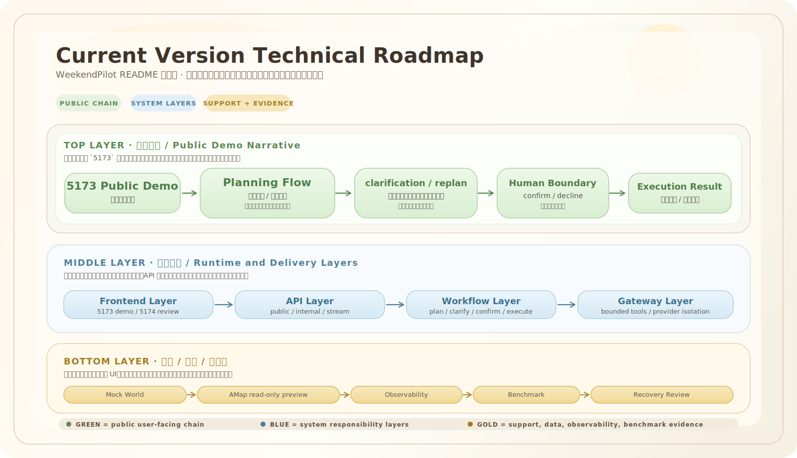

# WeekendPilot

WeekendPilot 是一个面向 `2-6` 小时本地生活场景的规划、确认与执行系统。当前交付版本以 `Mock World` 作为默认数据面，以 `benchmark`、`observability` 和 `recovery review` 作为可审计交付基础，目标是支持稳定演示、稳定评审和稳定初步交付。

## 当前版本摘要

| 维度 | 当前状态 |
| --- | --- |
| 版本口径 | 当前提交口径收敛为 `V2 Integrity Edition`；`V1.5 baseline` 作为已完成基线背景保留，当前主打 benchmark 完整性、memory governance、observability 与 recovery 可审计性 |
| 公开主链 | `5173` 公开 demo 已收束为可演示的主链：`planning`、`clarification`、`replan`、`confirm / decline`、`execution` |
| 技术支撑 | `5174` 内部评审页提供 `Benchmark Summary`、`System Integrity Summary`、`Trace Summary`、`Benchmark Artifacts` 与 `Recovery Visualization`，其中 `Benchmark Summary` 会展示 suite 级 timing percentile 与 stage 分布 |
| 交付边界 | `Mock World`、`benchmark`、`recovery review` 与 `AMap read-only preview` 都已纳入当前版本的说明和验证边界 |

## 当前版本技术路线图



这张图可以按“公开主链 -> 系统分层 -> 数据与证据支撑”三层来读。

## 项目完成情况

项目已经收敛到“可初步交付、可稳定演示、可审计评审”的状态，当前完成内容如下：

- 公开 demo 主链已经可用：`happy path`、`clarification`、`replan`、`decline`、`action manifest`、`execution result`
- 公开交互页已经固定为 `http://127.0.0.1:5173/`，关键 reviewer-facing 文案为中文
- 内部评审页已经固定为 `http://127.0.0.1:5174/`，可展示 `Benchmark Summary`、`System Integrity Summary`、`Trace Summary`、`Benchmark Artifacts`、`Recovery Visualization`，并在 `Benchmark Summary` 中展示 suite 级 `p50 / p95 / p99 / max` 与 stage timing percentile
- `AMap` 已接入为 `API-only` 的 `read-only preview`，可规划和查看候选，但确认后写动作会被 `409` 阻断
- 公开 API / 内部 API 已稳定保留：
  - `POST /demo/runs`
  - `POST /demo/runs/stream`
  - `POST /demo/runs/{run_id}/clarify`
  - `POST /demo/runs/{run_id}/replan`
  - `POST /demo/runs/{run_id}/confirm`
  - `POST /demo/runs/{run_id}/decline`
  - `GET /internal/runs/{run_id}/observability`
  - `GET /internal/benchmarks/release-gate-v1/summary`
- 评审辅助材料已经补齐：
  - `docs/WEB_DEMO_README.md`
  - `docs/V1_5_REVIEW_EVIDENCE.md`
  - `docs/submission/FUNCTION_COVERAGE_MAP.md`
  - `docs/submission/EVIDENCE_MAP.md`

当前默认边界：

- `AMap` 不进入 customer UI 主链，只通过脚本和 API 演示
- `benchmark` 默认使用 `Mock World`，不依赖外部地图或真实写接口
- `AMap` 仍是 `API-only read-only preview`，不参与正式 benchmark，也不作为 `V2 Integrity Edition` 的主交付依赖
- 可选 `LLM-backed preview` 不是本次提交主路径

## Mock World

`Mock World` 是 WeekendPilot 当前用于公开 demo、正式 benchmark 和大部分自动化验证的确定性的默认数据面。

- 它不依赖外部地图或真实写接口，因此适合稳定复现规划、确认、执行与失败恢复链路
- 它覆盖了六个公开 scenario：`亲子`、`朋友`、`单人`、`情侣`、`雨天`、`预算`
- 这些公开 scenario 背后映射到已注册 world profile，例如 `family_afternoon`、`friends_gathering`、`solo_afternoon`、`couple_afternoon`、`rainy_day_fallback`、`budget_lite`
- 它不是只包含“最终会被选中的标准答案点位”，而是故意放入额外候选、`distractor`、不可用候选和部分 route 不可行组合，用来验证筛选、fallback、排序稳定性和安全停机
- `release_gate_v1`、`coverage_gate_v1_5` 和 `all_registered` 当前都固定在 `Mock World`
- `AMap` 只作为 `API-only` 的 `read-only preview`，不参与正式 benchmark，也不进入默认评审主链

选择 `Mock World` 的原因不是“模拟一切”，而是把当前作品评审重点放在产品闭环与工程可审计性上：规划逻辑、确认边界、执行链路、版本演化、失败恢复、evidence 产出，都能在本地稳定复现。

## 启动方式

### 1. 首次初始化

```powershell
cd E:\ai项目\面试准备\hackathon
python -m venv .venv
.\.venv\Scripts\Activate.ps1
python -m pip install -e ".[dev]"
npm --prefix frontend install
```

可选本地环境变量：

```text
AMAP_MAPS_API_KEY=your-local-key
```

只有在你要演示 `AMap read-only preview` 时才需要这个 key。

### 2. 启动后端与基础依赖

```powershell
docker compose up -d postgres redis
python -m alembic upgrade head
uvicorn backend.app.main:app --reload
```

### 3. 启动两个前端页面

公开 demo 页：

```powershell
npm --prefix frontend run dev
```

内部评审页：

```powershell
npm --prefix frontend run dev:internal
```

### 4. 打开地址

- API 健康检查：`http://127.0.0.1:8000/health`
- 公开 demo 页：`http://127.0.0.1:5173/`
- 内部评审页：`http://127.0.0.1:5174/`

### 5. 正式启动前检查

```powershell
python scripts/demo_preflight.py
```


## Benchmark 覆盖

当前仓库的 `benchmark` 与 evidence 体系分成六个主要入口：

| 入口 | 包含内容 | 当前 canonical evidence |
| --- | --- | --- |
| `release_gate_v1` | 阻塞式主基线，覆盖 `15` 个 `L1-L3` `Mock World` case，验证主产品路径、确认边界、执行链路与 1 个路由失败 case | `var/formal-benchmarks/latest-release_gate_v1-run-report.json` |
| `coverage_gate_v1_5` | 基于 `all_registered` 的覆盖率 / 多样性 gate，验证场景广度、tag 覆盖、failure mode 覆盖 | `var/formal-benchmarks/latest-coverage_gate_v1_5-run-report.json` |
| `v2_integrity_gate` | V2 Integrity Edition 的当前阻塞 gate，汇总完整性矩阵、memory mode、conversation mode 与 failure mode 覆盖 | `var/formal-benchmarks/latest-v2_integrity_gate-run-report.json` |
| `v2_integrity_passk` | V2 Integrity Edition 的重复运行稳定性指标，覆盖 `Success@1`、`Pass@4`、`Pass^4` | `var/formal-benchmarks/stability/latest-v2_integrity-passk-v0-report.json` |
| `all_registered` | 全量 `30` 个已注册 case 的 `formal verification`，覆盖 `clarification`、`replan/versioning`、`memory governance`、`robustness`、`recovery-related` case | `var/formal-benchmarks/latest-all_registered-run-report.json` |
| `family_route_failure_v1` | 固定失败恢复审查链，验证 benchmark failure path、replay 一致性、observability 链接一致性 | `var/recovery-reviews/latest-family_route_failure_v1-review.json` |
| `safe_stop_gate_v1` | 聚焦 `recovery_focused` 的安全停机 gate，验证 8 个组合失败 case 都以零写动作、bounded chain、terminal `stop_safely` 收束 | `var/formal-benchmarks/latest-safe_stop_gate_v1-run-report.json` |

按能力看，当前 `benchmark` 已覆盖：

- 场景广度：亲子、朋友、单人、情侣、雨天、预算、老人等
- 多轮对话：`clarification`、`replan`、`versioning`
- 执行边界：确认前只读、确认后写动作
- 记忆治理：`memory governance`
- 稳健性：噪声候选、fallback、排序稳定性
- 失败恢复：`route_unavailable` 与 `recovery replay review`

### 当前 benchmark 状态

以下信息来自当前 canonical latest evidence，用于说明“现在这份项目”已经跑到了什么程度。

| 检查项 | 当前状态 | 关键细节 |
| --- | --- | --- |
| `release_gate_v1` | `passed`，`15/15` 通过，`overall_score=1.0` | `Mock World` 全量通过，层级分布为 `L1=3, L2=8, L3=4`；failure mode 为 `none=14`、`route_unavailable=1`；当前关键时延为 `p50=390ms`、`p95=424ms`、`max=424ms` |
| `coverage_gate_v1_5` | `passed`，`30/30` 通过，`overall_score=1.0` | 场景桶分布为 `couple=1`、`elder=2`、`family=16`、`friends=3`、`mixed=4`、`solo=2`、`unknown=2`；world profile 分布为 `budget_lite=3`、`couple_afternoon=1`、`elder_afternoon=2`、`family_afternoon=16`、`friends_gathering=3`、`rainy_day_fallback=3`、`solo_afternoon=2` |
| `v2_integrity_gate` | `passed`，`20/20` 通过，`release_blocked=false` | `5174` 的 `System Integrity Summary` 与 evidence summary 脚本都以它作为当前 V2 完整性 gate 入口 |
| `v2_integrity_passk` | `passed`，`Success@1=1.0`，`Pass@4=1.0`，`Pass^4=1.0` | 当前 canonical stability alias 为 `var/formal-benchmarks/stability/latest-v2_integrity-passk-v0-report.json`，用于说明 repeated-run stability |
| `all_registered` | `passed`，`30/30` 通过，`overall_score=1.0` | 代表性 tag 覆盖包括 `conversation_continuation=2`、`memory_governance=5`、`robustness_case=4`、`elder_friendly=2`、`friends_group=3`、`rainy_day=3`，并新增组合失败覆盖与 `safe_stop_gate_v1` |
| `family_route_failure_v1` | `recovery review passed`，`3/3` 检查通过 | 当前失败注入链为 `check_route:route_infeasible:failed`，恢复动作是 `stop_safely`，终态为 `terminal_workflow_status=failed`，说明系统走的是“安全停机而非错误执行” |

如果你只想快速查看当前 evidence 状态，直接运行：

```bash
python scripts/show_submission_evidence.py
```

如果你需要刷新 evidence，使用这些命令：

```bash
python scripts/run_benchmark_release_gate.py
python scripts/run_benchmark_coverage_gate.py
python scripts/run_formal_verification.py
python scripts/run_recovery_replay_review.py
```

`python scripts/run_recovery_replay_review.py` 仍然默认跑 reviewer-facing 的 canonical case `family_route_failure_v1`，并刷新 `var/recovery-reviews/latest-family_route_failure_v1-review.json`。

如果你需要做工程侧的泛化 recovery replay 验证，而不是替换 canonical reviewer 口径，可以额外使用：

```bash
python scripts/run_recovery_replay_review.py --case-id family_route_and_dining_unavailable_v1
python scripts/run_recovery_replay_review.py --suite-id recovery_focused
```

## 测试结果

以下结果基于本地核对，属于当前 README 所引用的最新验证记录。

### 1. 当前 benchmark / evidence 状态

| 检查项 | 结果 |
| --- | --- |
| `release_gate_v1` | `passed`，`15/15` 通过，`failed=0`，`error=0`，`overall_score=1.0` |
| `coverage_gate_v1_5` | `passed`，`30/30` 通过，`failed=0`，`error=0`，`overall_score=1.0` |
| `v2_integrity_gate` | `passed`，`20/20` 通过，`failed=0`，`error=0`，`release_blocked=false` |
| `v2_integrity_passk` | `passed`，`executed_run_count=4`，`Success@1=1.0`，`Pass@4=1.0`，`Pass^4=1.0` |
| `all_registered` | `passed`，`30/30` 通过，`failed=0`，`error=0`，`overall_score=1.0` |
| `safe_stop_gate_v1` | `passed`，`8/8` 通过，`failed=0`，`error=0`，全部 recovery case 都是零写动作安全停机 |
| `family_route_failure_v1` recovery review | `passed`，`3/3` 检查通过 |

对应检查命令：

```bash
python scripts/show_submission_evidence.py
```

### 2. 已核对的聚焦测试

后端 / 文档 / evidence 聚焦测试：

```bash
python -m pytest tests/test_demo_support_scripts.py tests/test_review_evidence.py -q
```

当前结果：

- `23 passed`

前端聚焦单元测试：

```bash
npm --prefix frontend test -- --run src/chat/ConversationThread.test.tsx src/App.test.tsx
```

当前结果：

- `2` 个测试文件通过
- `24 passed`

若你需要完整 runbook，请看 [docs/WEB_DEMO_README.md](docs/WEB_DEMO_README.md)。

## 详细文档

- 架构设计：[docs/COMPETITION_DESIGN_DOCUMENT.md](docs/COMPETITION_DESIGN_DOCUMENT.md)
- Web demo 运行手册：[docs/WEB_DEMO_README.md](docs/WEB_DEMO_README.md)
- 提交与录制总览：[docs/submission/OVERVIEW.md](docs/submission/OVERVIEW.md)
- reviewer evidence 入口：[docs/V1_5_REVIEW_EVIDENCE.md](docs/V1_5_REVIEW_EVIDENCE.md)
- 提交前可运行：`python scripts/verify_review_evidence.py`
